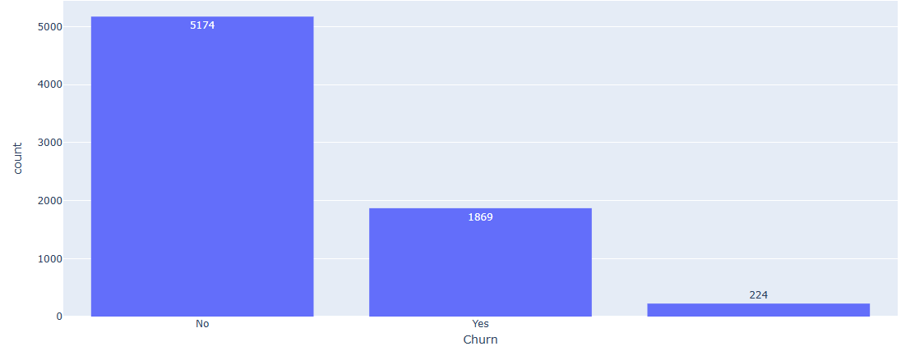
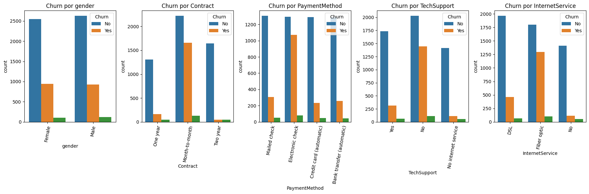

# Análise de Cancelamento — Telecom X

## 📚 Índice

- [Descrição do Projeto](#descrição-do-projeto)
- [Funcionalidades, Demonstrações e Insights](#funcionalidades-e-demonstrações)
- [Maiores Porcentagens de Churn por Categoria](#maiores-e-porcentagens)
- [Tecnologias Utilizadas](#tecnologias-utilizadas)

---

## 📌 Descrição do Projeto

Este projeto realiza uma análise detalhada sobre o churn (evasão) de clientes da empresa fictícia **Telecom X**, com o objetivo de identificar padrões e fatores que influenciam o cancelamento de serviços. A análise utiliza técnicas de ciência de dados, incluindo limpeza e tratamento de dados, análise exploratória e visualização, para apoiar estratégias de retenção.

---

## 📊 Funcionalidades e Demonstrações

### Proporção de Cancelamentos

- Cerca de **25,7%** dos clientes cancelaram o serviço.

### Maiores Porcentagens de Churn por Categoria

- Clientes por sexo, contratos Suporte Técnico, Serviço  e  métodos de pagamento apresentaram  risco de cancelamento. O maior risto de cancelando foi pelo método de cancelamento em débito automático.

 ## 🛠 Tecnologias Utilizadas

- Python 3  
- Pandas  
- NumPy  
- Matplotlib  
- Seaborn
- IPython
- Google Colab 
